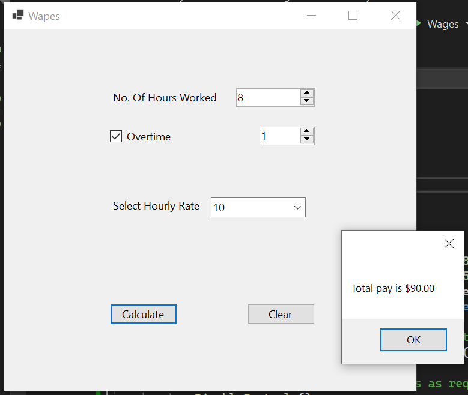

# Wages

A Program to Calculate Pay | Windows Forms .NET | Within course CMETB&RiBHTraining

## A software requirements specification (SRS)
Write a program that calculates total weekly pay as illustrated below. The user enters the number of hours worked and selects the hourly rate of pay from a list box. If overtime has been done, the number of hours is also entered. Overtime hours are any hours over 40 and are paid at double the hourly rate. A check box handles overtime. Clicking this should make visible the text box for inputting the number of overtime hours. Other key features that need to be incorporated include the following:
Only allow a minimum of 8 and a maximum of 55 hours to be the number of hours worked in total 
Have all controls disabled on form until required to be used
The users pay upon clicking on calculate button should be calculated and displayed via a message box/label

## Tech stack
- `C#`
- .NET 6.0
- Target OS: Windows
- Target OS version: 7.0
- Windows Forms

